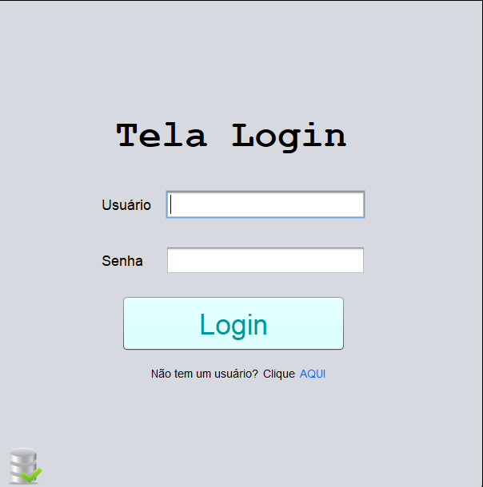
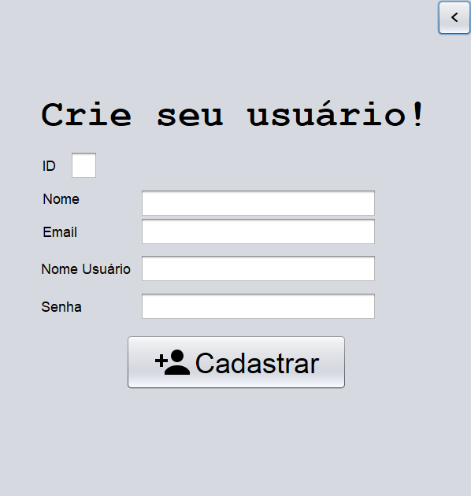
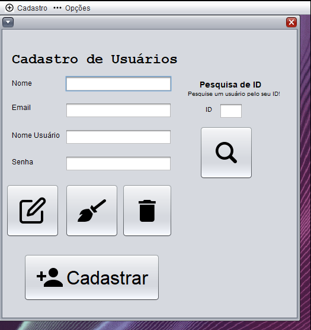
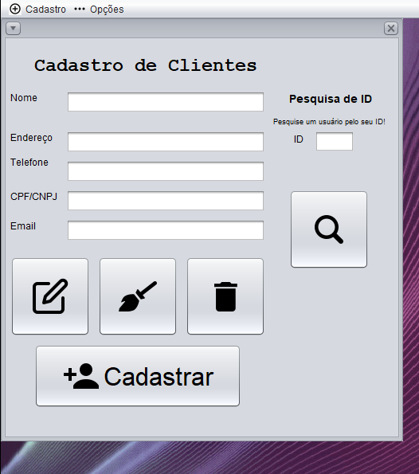
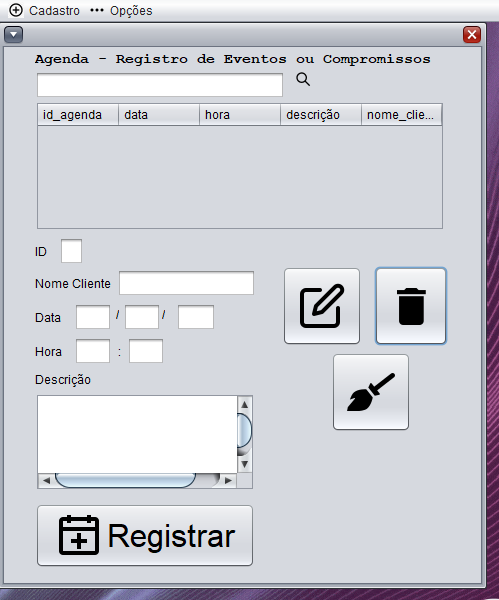

### Descrição:
O repositório POOIITrabalhoFinal armazena o Register System, nosso projeto e trabalho de conclusão da disciplina Programação Orientada a Objetos II (POOII) no Técnico em Informática no Colégio ULBRA São Lucas. Ele é um sistema com o objetivo de cadastrar o seguinte: Usuários, Clientes e Eventos, através de um Cadastro de Usuários e Clientes, e por fim Agenda, sendo capaz de fazer as operações CRUD.

## Ficha Ténica:

Desenvolvedor(a): @Xenoxys1 e @eduardahermannalmeida 

Linguagens:

Software:

Ícones:

https://www.iconfinder.com

## Preview:

### Tela de Login

### Tela de Cadastro para Usuários que não tem nenhum cadastro prévio.

### Tela Principal

### Tela de Cadastro de Usuários

### Tela de Cadastro de Clientes

### Tela Agenda (para registro de eventos ou compromissos)

