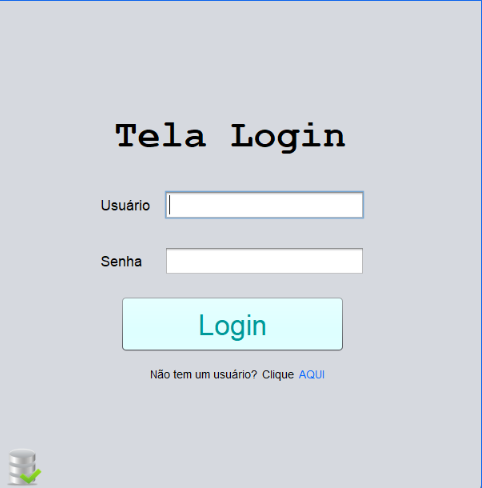
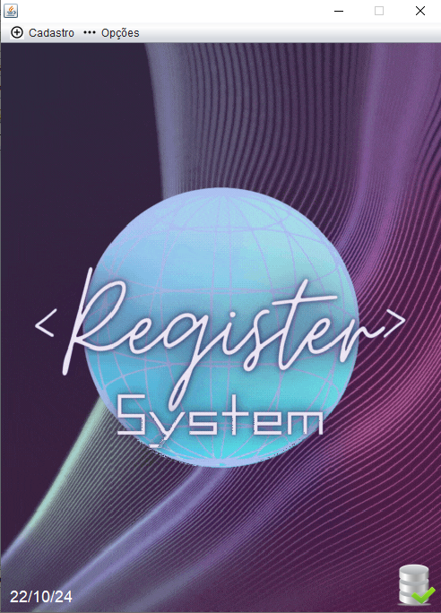
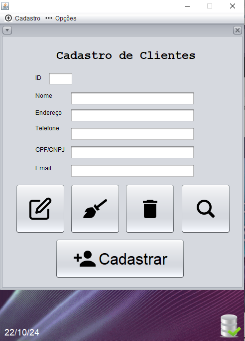

### Descrição:
O repositório POOIITrabalhoFinal armazena o Register System, nosso projeto e trabalho de conclusão da disciplina Programação Orientada a Objetos II (POOII) no Técnico em Informática no Colégio ULBRA São Lucas. Ele é um sistema com o objetivo de cadastrar o seguinte: Usuários, Clientes e Eventos, através de um Cadastro de Usuários e Clientes, e por fim Agenda, sendo capaz de fazer as operações CRUD.

## Ficha Ténica:

Desenvolvedor(a): @Xenoxys1 e @eduardahermannalmeida 

Linguagens:

Software:

Ícones:

https://www.iconfinder.com

## Arquitetura do Sistema

Lorem ipsum dolor sit amet, consectetur adipiscing elit. In finibus molestie dui eget convallis. Vivamus quis sapien eu metus sodales efficitur eu sit amet metus. Donec nec aliquet orci. Nullam hendrerit auctor velit. Proin pharetra elit ut turpis dictum eleifend. Etiam dignissim fringilla urna, at dignissim lectus lacinia non. Morbi eget lacinia eros.

Aliquam ut aliquam augue. Phasellus gravida mi vitae libero feugiat auctor. Nulla sed dignissim dui, id pretium nisi. Suspendisse maximus sapien at pulvinar posuere. Sed eleifend lorem eget libero pulvinar, eu dictum ex tristique. Praesent dignissim interdum dolor, vel viverra nibh facilisis eu. Quisque mattis metus sit amet orci laoreet dapibus id at lorem. Sed volutpat elit ac egestas vestibulum. Mauris tristique lobortis eros eget ultricies. Vivamus eget condimentum dolor, et posuere mi. Duis sed erat quam.

;

## Preview:

### Tela de Login

### Tela de Cadastro para Usuários que não tem nenhum cadastro prévio.

### Tela Principal

### Tela de Cadastro de Usuários

### Tela de Cadastro de Clientes

### Tela Agenda (para registro de eventos ou compromissos)

## Instruções de execução e conexão com o banco de dados local

## Execução
Lorem ipsum dolor sit amet, consectetur adipiscing elit. In finibus molestie dui eget convallis. Vivamus quis sapien eu metus sodales efficitur eu sit amet metus. Donec nec aliquet orci. Nullam hendrerit auctor velit. Proin pharetra elit ut turpis dictum eleifend. Etiam dignissim fringilla urna, at dignissim lectus lacinia non. Morbi eget lacinia eros.

Aliquam ut aliquam augue. Phasellus gravida mi vitae libero feugiat auctor. Nulla sed dignissim dui, id pretium nisi. Suspendisse maximus sapien at pulvinar posuere. Sed eleifend lorem eget libero pulvinar, eu dictum ex tristique. Praesent dignissim interdum dolor, vel viverra nibh facilisis eu. Quisque mattis metus sit amet orci laoreet dapibus id at lorem. Sed volutpat elit ac egestas vestibulum. Mauris tristique lobortis eros eget ultricies. Vivamus eget condimentum dolor, et posuere mi. Duis sed erat quam.

### Conexão 
Lorem ipsum dolor sit amet, consectetur adipiscing elit. In finibus molestie dui eget convallis. Vivamus quis sapien eu metus sodales efficitur eu sit amet metus. Donec nec aliquet orci. Nullam hendrerit auctor velit. Proin pharetra elit ut turpis dictum eleifend. Etiam dignissim fringilla urna, at dignissim lectus lacinia non. Morbi eget lacinia eros.

Aliquam ut aliquam augue. Phasellus gravida mi vitae libero feugiat auctor. Nulla sed dignissim dui, id pretium nisi. Suspendisse maximus sapien at pulvinar posuere. Sed eleifend lorem eget libero pulvinar, eu dictum ex tristique. Praesent dignissim interdum dolor, vel viverra nibh facilisis eu. Quisque mattis metus sit amet orci laoreet dapibus id at lorem. Sed volutpat elit ac egestas vestibulum. Mauris tristique lobortis eros eget ultricies. Vivamus eget condimentum dolor, et posuere mi. Duis sed erat quam.

### Scripts SQL
Lorem ipsum dolor sit amet, consectetur adipiscing elit. In finibus molestie dui eget convallis. Vivamus quis sapien eu metus sodales efficitur eu sit amet metus. Donec nec aliquet orci. Nullam hendrerit auctor velit. Proin pharetra elit ut turpis dictum eleifend. Etiam dignissim fringilla urna, at dignissim lectus lacinia non. Morbi eget lacinia eros.

Aliquam ut aliquam augue. Phasellus gravida mi vitae libero feugiat auctor. Nulla sed dignissim dui, id pretium nisi. Suspendisse maximus sapien at pulvinar posuere. Sed eleifend lorem eget libero pulvinar, eu dictum ex tristique. Praesent dignissim interdum dolor, vel viverra nibh facilisis eu. Quisque mattis metus sit amet orci laoreet dapibus id at lorem. Sed volutpat elit ac egestas vestibulum. Mauris tristique lobortis eros eget ultricies. Vivamus eget condimentum dolor, et posuere mi. Duis sed erat quam.

