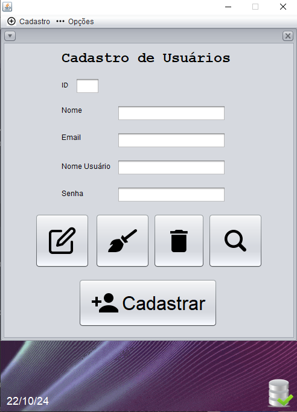

### Descrição:
O repositório POOIITrabalhoFinal armazena o Register System, nosso projeto e trabalho de conclusão da disciplina Programação Orientada a Objetos II (POOII) no Técnico em Informática no Colégio ULBRA São Lucas. Ele é um sistema com o objetivo de cadastrar o seguinte: Usuários, Clientes e Eventos, através de um Cadastro de Usuários e Clientes, e por fim Agenda, sendo capaz de fazer as operações CRUD.

## Ficha Ténica:

Desenvolvedores: @Xenoxys1 e @eduardahermannalmeida 

Linguagens:

Software:

Ícones:

https://www.iconfinder.com

## Arquitetura do Sistema

Na pasta VIEW há todos os JFrames e InternalJFrames necessários para a visualização do programa, eles são a base de tudo e servem para facilitar a interação com o sistema. Na pasta Source ficam todas as classes que são usadas no sistema, com suas respectivas
funções, variáveis e relações entre os frames de interação, em resumo, é a fonte de todo o código utilizado para o programa funcionar corretamente. A pasta IMG contém todas as imagens e ícones que foram utilizados para uma estilização mais consistente e agradável
para o programa, a maioria dos ícones foram todos tirados gratuitamente do site Iconfinder. Na biblioteca do nosso projeto, há todos os arquivos .jar utilizados para a conexão com o MySQL e algumas funções extras como data e hora.

;

## Preview:

### Tela de Login

### Tela de Cadastro para Usuários que não tem nenhum cadastro prévio.

### Tela Principal

### Tela de Cadastro de Usuários

### Tela de Cadastro de Clientes

### Tela Agenda (para registro de eventos ou compromissos)

## Instruções de execução e conexão com o banco de dados local

## Execução
Lorem ipsum dolor sit amet, consectetur adipiscing elit. In finibus molestie dui eget convallis. Vivamus quis sapien eu metus sodales efficitur eu sit amet metus. Donec nec aliquet orci. Nullam hendrerit auctor velit. Proin pharetra elit ut turpis dictum eleifend. Etiam dignissim fringilla urna, at dignissim lectus lacinia non. Morbi eget lacinia eros.

Aliquam ut aliquam augue. Phasellus gravida mi vitae libero feugiat auctor. Nulla sed dignissim dui, id pretium nisi. Suspendisse maximus sapien at pulvinar posuere. Sed eleifend lorem eget libero pulvinar, eu dictum ex tristique. Praesent dignissim interdum dolor, vel viverra nibh facilisis eu. Quisque mattis metus sit amet orci laoreet dapibus id at lorem. Sed volutpat elit ac egestas vestibulum. Mauris tristique lobortis eros eget ultricies. Vivamus eget condimentum dolor, et posuere mi. Duis sed erat quam.

### Conexão 
O sistema em si funciona de uma forma um tanto simples, a conexão é feita à partir da classe ConexaoDAO que contém um método capaz de estabelecer a conexão do MySQL com o Java utilizando do mysql-connector-9.0.0 e consequentemente informar o usuário de erros através do Try-Catch Exception. À partir daí todas as classes como ClienteDAO, AgendaDAO, UsuarioDAO utilizam do mesmo método estabelecido no ConexaoDAO junto de outros comandos como PreparedStatement e ResultSet para suas ações.

### Scripts SQL

CREATE DATABASE  IF NOT EXISTS `bdtrabalhofinal`;
USE `bdtrabalhofinal`;

DROP TABLE IF EXISTS `tb_agenda`;

CREATE TABLE `tb_agenda` (
  `id_agenda` int NOT NULL AUTO_INCREMENT,
  `data_agenda` date NOT NULL,
  `hora` time NOT NULL,
  `descricao` varchar(150) NOT NULL,
  `nome_clientes` varchar(100) NOT NULL,
  PRIMARY KEY (`id_agenda`)
) ENGINE=InnoDB AUTO_INCREMENT=3 DEFAULT CHARSET=utf8mb4 COLLATE=utf8mb4_0900_ai_ci;

LOCK TABLES `tb_agenda` WRITE;

UNLOCK TABLES;

DROP TABLE IF EXISTS `tb_clientes`;

CREATE TABLE `tb_clientes` (
  `id_clientes` int NOT NULL AUTO_INCREMENT,
  `nome` varchar(100) CHARACTER SET utf8mb4 COLLATE utf8mb4_0900_ai_ci NOT NULL,
  `endereco` varchar(300) CHARACTER SET utf8mb4 COLLATE utf8mb4_0900_ai_ci NOT NULL,
  `telefone` varchar(14) CHARACTER SET utf8mb4 COLLATE utf8mb4_0900_as_cs NOT NULL,
  `email` varchar(250) CHARACTER SET utf8mb4 COLLATE utf8mb4_0900_ai_ci NOT NULL,
  `cpf_cnpj` varchar(14) CHARACTER SET utf8mb4 COLLATE utf8mb4_0900_ai_ci NOT NULL,
  PRIMARY KEY (`id_clientes`)
) ENGINE=InnoDB AUTO_INCREMENT=10 DEFAULT CHARSET=utf8mb4 COLLATE=utf8mb4_0900_as_cs;

LOCK TABLES `tb_clientes` WRITE;

UNLOCK TABLES;

DROP TABLE IF EXISTS `tb_usuarios`;

CREATE TABLE `tb_usuarios` (
  `id_usuarios` int NOT NULL AUTO_INCREMENT,
  `nome` varchar(100) NOT NULL,
  `email` varchar(250) NOT NULL,
  `nome_usuario` varchar(45) NOT NULL,
  `senha` varchar(32) NOT NULL,
  PRIMARY KEY (`id_usuarios`)
) ENGINE=InnoDB AUTO_INCREMENT=18 DEFAULT CHARSET=utf8mb4 COLLATE=utf8mb4_0900_ai_ci;

LOCK TABLES `tb_usuarios` WRITE;

UNLOCK TABLES;

